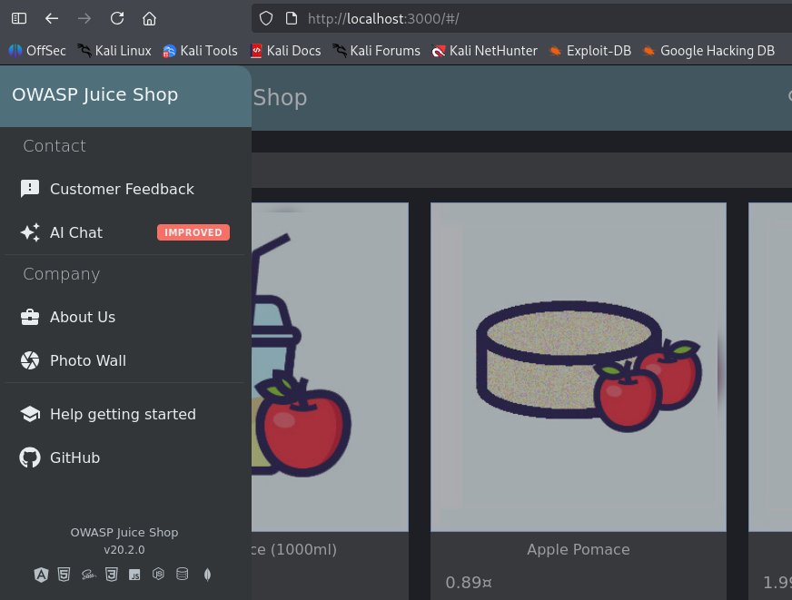
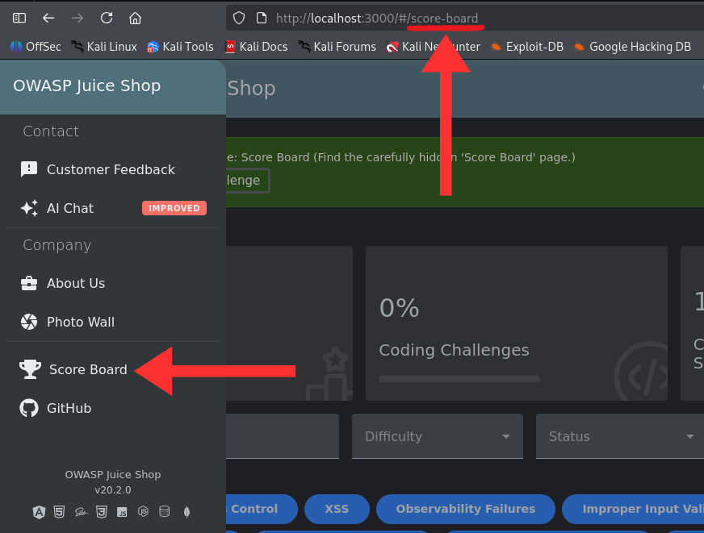

# Forced Browsing to Hidden Score Board Page (Broken Access Control)

## Summary
The /score-board page is not linked in the application's navigation menu for unauthenticated or unprivileged users, giving the impression that it is restricted or hidden. However, the page has no server-side access control and can be reached directly by manually entering the URL, exposing functionality and data that was intended to remain inaccessible.

## Severity
Medium CVSS 3.1 Base Score: 5.3  
CVSS:3.1/AV:N/AC:L/PR:N/UI:N/S:U/C:L/I:N/A:N

## Category (OWASP Classification)
A01:2021 – Broken Access Control Sub-type: Forced Browsing / Missing Function-Level Access Control Related CWE: CWE-425 (Direct Request / "Forced Browsing"), CWE-284 (Improper Access Control)

## Affected Component
- URL/Endpoint: `/score-board`
- Application: OWASP Juice Shop
- Environment: Local instance, version 20.2.0

## Description
Forced browsing (also known as Predictable Resource Location, File Enumeration, or Resource Enumeration) is an attack in which a user accesses application resources that are not referenced or linked anywhere in the UI, but which remain reachable because the server never verifies whether the request is authorized. This typically happens when developers rely on hiding a link or menu item as their only "protection," instead of enforcing an access-control check on the server for every request to that route.

In this case, the Juice Shop score board is only hidden from the navigation menu client-side. The underlying route /score-board performs no authentication or authorization check, so any user (logged in or not) can load it directly by typing the URL. Once visited, the application even updates its own client-side state and reveals the "Score Board" link in the navigation menu going forward, confirming that visibility was the only control in place.

## Steps to Reproduce
1. On home page, manually enter `/score-board` in the URL bar
2. Observe that the page loads without authentication or menu access
3. Note that the "Score Board" menu item now appears in the navigation bar

## Proof of Concept (Screenshots/Video)
  
  
1st image: navigation menu without Score Board.  
2nd image: page loaded directly via URL, and the link now appears.

## Impact
- Access hidden or "beta" functionality not meant for general users
- Enumerate other unlinked routes by guessing common admin/debug paths (e.g., `/admin`, `/metrics`, `/#/administration`)
- Gain a roadmap of internal application structure, aiding further attacks
- In applications where hidden pages expose more sensitive functionality (e.g., admin panels, internal APIs), this same flaw could lead to full account or data compromise rather than just leaderboard exposure

## Root Cause
The application enforces visibility, not access control. The decision to show or hide the "Score Board" menu item is made entirely in the frontend (e.g., a conditional render), while the backend route serves the page to any request regardless of session or role. This is a common anti-pattern: developers assume that if a link isn't visible, the page is effectively private, but URLs are guessable, bookmarkable, and easily found through enumeration or a directory brute-force tool like `ffuf`, `gobuster`, or Burp Suite's Intruder.

## Remediation / Recommendation
- Enforce authorization checks server-side, on every request to sensitive routes — never rely on hiding UI elements as a security boundary.
- Apply "fail securely" / deny-by-default: routes should require an explicit authorization decision before returning data, not just default to open.
- Use route guards or middleware (e.g., `role/session checks`) consistently across all endpoints, including ones not currently linked in the UI.
- Periodically audit the application for routes with no corresponding access-control middleware, especially ones added during development/testing that were never removed or locked down.

## References
- OWASP Top 10: A01:2025 – Broken Access Control
- CWE-425: Direct Request ('Forced Browsing')
